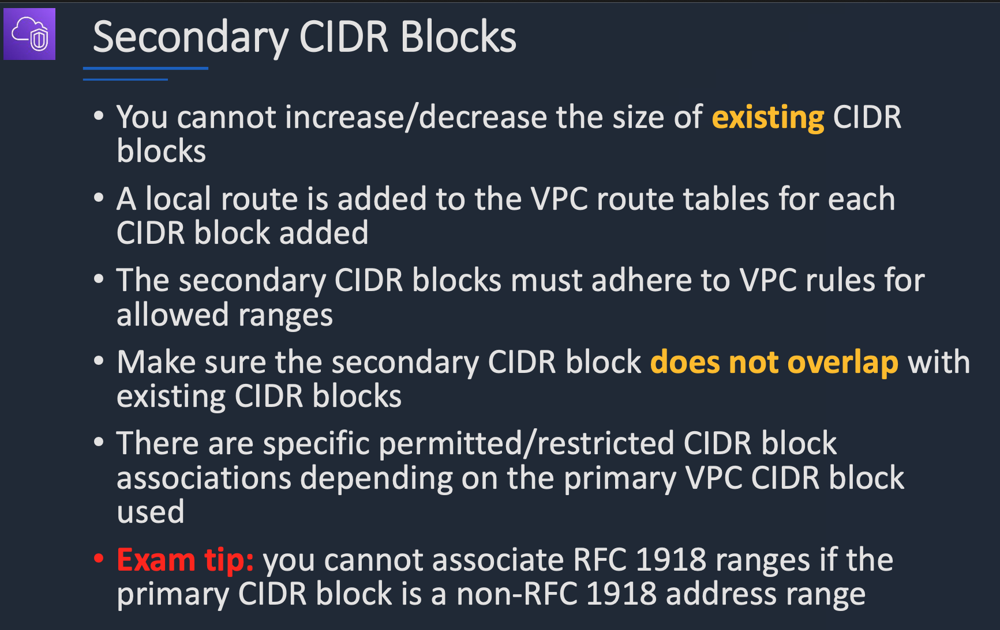

# Secondary CIDR Blocks

### RFC 1918
RFC 1918 ranges are the officially defined private IP address ranges that are not routable on the public internet.
They are used for internal networks such as home WiFi, corporate LAN, AWS VPCs, Kubernetes clusters, etc.

**Here are the three private IPv4 ranges defined by RFC 1918:**

| Range                               | CIDR            | Size        | Common Use Cases                         |
|------------------------------------|-----------------|-------------|-------------------------------------------|
| 10.0.0.0 – 10.255.255.255          | 10.0.0.0/8      | 16,777,216  | AWS VPCs, large enterprise networks       |
| 172.16.0.0 – 172.31.255.255        | 172.16.0.0/12   | 1,048,576   | Corporate networks, VPNs                  |
| 192.168.0.0 – 192.168.255.255      | 192.168.0.0/16  | 65,536      | Home routers (192.168.0.x / 192.168.1.x) |
